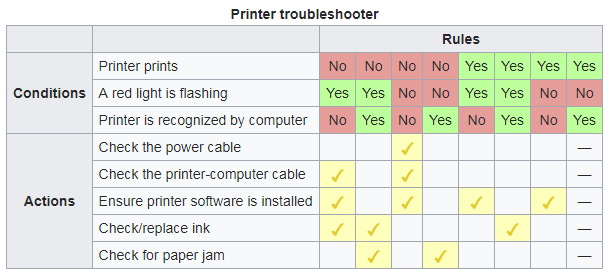

# C#-Core-Constructs-I-Projects
Projects that cover variables, printing, loops, if/else

I have partially created the Visual Studio project structure for you. 
- The solution and project have separate names. To do this I unchecked the "Place solution and project in the same directory" checkbox.
- The Prob1 project has been started as a console app.
- It contains a comment template that I would like you to use on all projects for this class.

# Prob 1: Variables and Printing
* region 1: variable declarations

    page 18 in Troelsen shows two different ways to declare int variables. page 71 shows a third way using the "new" keyword.

    In this section declare three different **double** variables using each of the three type declarations.

* region 2: variable initialization

    The table on page 68 shows a number of numeric types.

    In this section declare separate variables for each numeric type that is **CLS compliant** and initialize it to some value non-zero value. Review the section on "Digit Separators" on p. 78 that shows different ways of formatting numeric literals that make them more readable. Try using some of these.

    Follow the section used to declare the variables with a code section that prints the values of each variable to the terminal. Try using format specifiers discussed on pages 66-67

* region 3: Max/Min values

    Open the documentation page on the System namespace (https://docs.microsoft.com/en-us/dotnet/api/system?view=netframework-4.7.1).

    Scroll down until you find any one of the numeric types and click on the type. Expand the Fields part of the description. You should see that a MaxValue and a MinValue are defined. 

    In this last section print the min and max values to the terminal screen. Use descriptive text in your print statements to provide context for the reader.

# Prob 2: Iteration Constructs

In the solution explorer bar, select the solution at the top and right-click. This will pop up a list. Select **Add** then **New Project**. Fill in the Language, Platform, and Project type dropdowns and and select **Console App (.NET Platform)**. Click Next and fill in "Prob2" for the project name and click Create.

For this problem print out the numbers 1-5 using several different loop structures.

* print 1-5 with spaces between the numbers on a single line using a **for** loop
* print 1-5 with spaces between the numbers on a single line using a **while** loop
* print 1-5 with spaces between the numbers on a single line using a **do/while** loop
* HINT: use Write() instead of WriteLine() in the loop body. Follow the loop with a WriteLine() call to insert the newline character at the end of the sequence.

# Prob 3: Decision Constructs

In the solution explorer bar, select the solution at the top and right-click. This will pop up a list. Select **Add** then **New Project**. Fill in the Language, Platform, and Project type dropdowns and and select **Console App (.NET Platform)**. Click Next and fill in "Prob3" for the project name and click Create.

Create a program that prints out all of the recommended actions based on the following decision table:

* Create methods for each of the actions. Each method should contain a print statement with the text from the Actions part of the table as the output. Note: these methods are at the same level as the Main() method and should follow Main().
* region 1 ( inside Main() ):
    * create 3 nested loops, one  for each condition.
    * in the body of the inner-most loop
        * print a line stating the conditions. For example: 

            Conditions: prints: False, flashing light: False, printer recognized: False

        * use if statements to call the appropriate methods to print out the possible actions.
        * use vertical spacing as appropriate to make the output readable.
* region 2 ( inside Main() ):
    * In a separate section of code implement a single for loop that iterates from 0 to 7. The programmer's trick here is to represent the condition values as a number. Using 0 for No and 1 for Yes, the conditions can be converted to a binary number. Use Printer prints as the most signicant bit, red light flashing as the next most significant, and so one. If all conditions are Yes, you get a binary number, 111 which translates to 7. Each column in the table above can be labeled with a number using this system.
    * In the loop body implement a switch statement that uses the iteration variable as its value. The code in each case will call the appropriate methods based on the number (column in the table).
